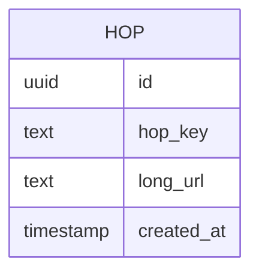
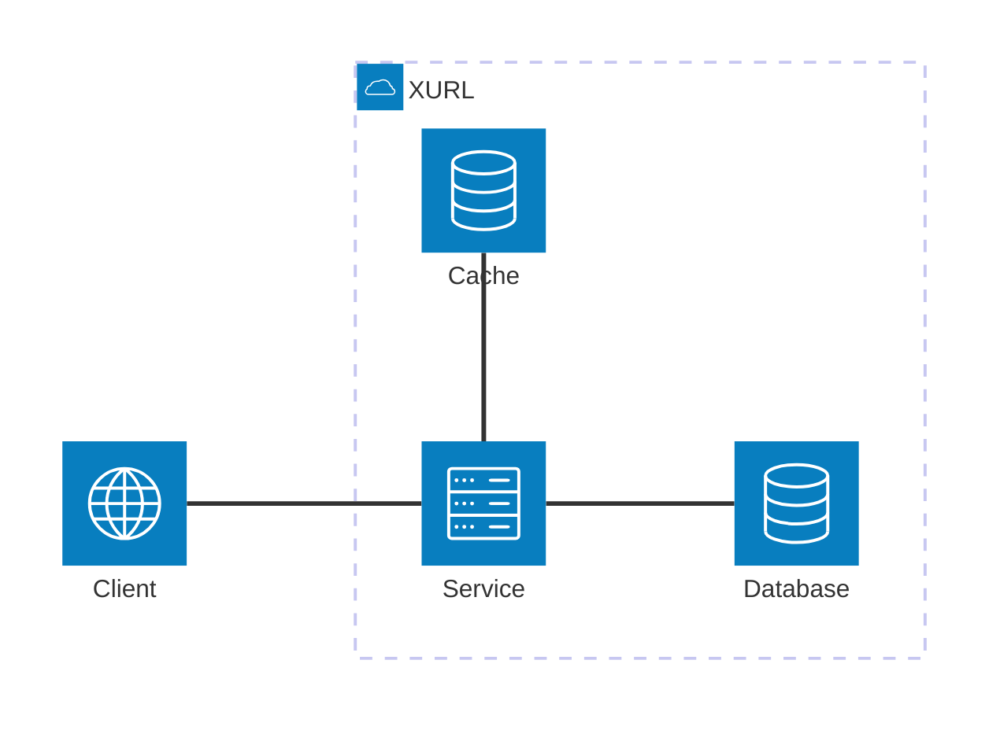
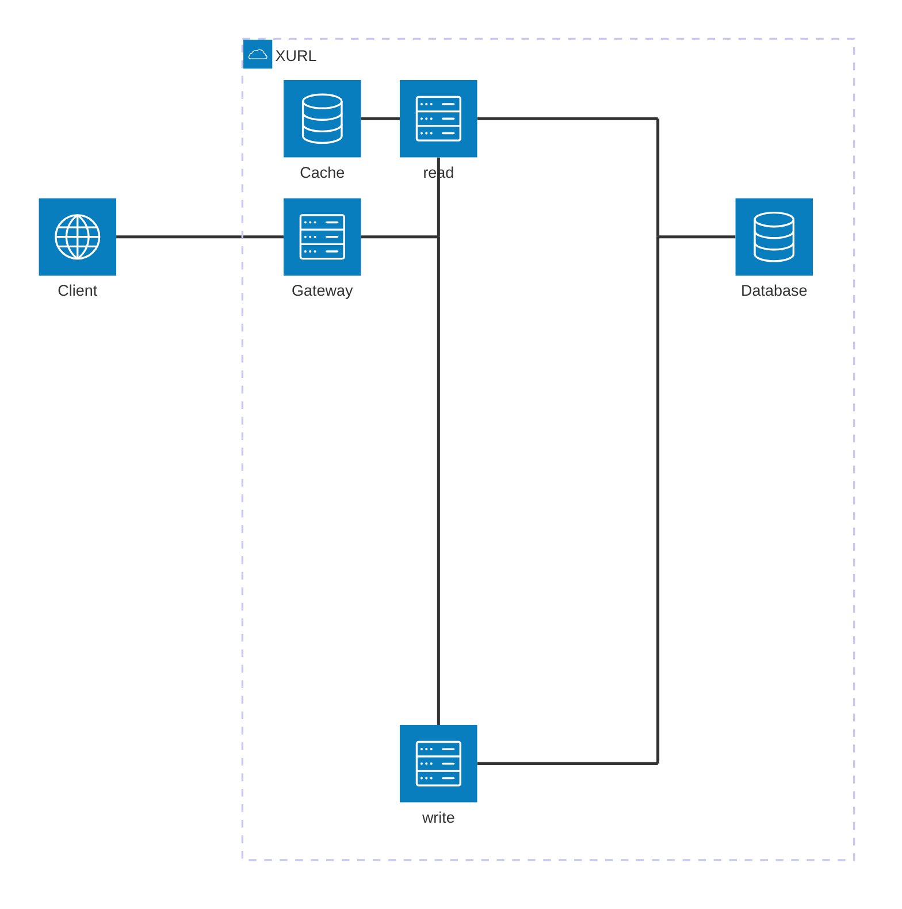

# xurl

This project was created using the [Ktor Project Generator](https://start.ktor.io).

Here are some useful links to get you started:

- [Ktor Documentation](https://ktor.io/docs/home.html)
- [Ktor GitHub page](https://github.com/ktorio/ktor)
- The [Ktor Slack chat](https://app.slack.com/client/T09229ZC6/C0A974TJ9). You'll need to [request an invite](https://surveys.jetbrains.com/s3/kotlin-slack-sign-up) to join.

## Features

Here's a list of features included in this project:

| Name                                                                   | Description                                                                        |
| ------------------------------------------------------------------------|------------------------------------------------------------------------------------ |
| [Dependency Injection](https://start.ktor.io/p/ktor-di)                | Enables dependency injection for your server                                       |
| [Routing](https://start.ktor.io/p/routing)                             | Provides a structured routing DSL                                                  |
| [kotlinx.serialization](https://start.ktor.io/p/kotlinx-serialization) | Handles JSON serialization using kotlinx.serialization library                     |
| [Content Negotiation](https://start.ktor.io/p/content-negotiation)     | Provides automatic content conversion according to Content-Type and Accept headers |
| [Exposed](https://start.ktor.io/p/exposed)                             | Adds Exposed database to your application                                          |
| [CORS](https://start.ktor.io/p/cors)                                   | Enables Cross-Origin Resource Sharing (CORS)                                       |

## Building & Running

To build or run the project, use one of the following tasks:

| Task                          | Description                                                          |
| -------------------------------|---------------------------------------------------------------------- |
| `./gradlew test`              | Run the tests                                                        |
| `./gradlew build`             | Build everything                                                     |
| `buildFatJar`                 | Build an executable JAR of the server with all dependencies included |
| `buildImage`                  | Build the docker image to use with the fat JAR                       |
| `publishImageToLocalRegistry` | Publish the docker image locally                                     |
| `run`                         | Run the server                                                       |
| `runDocker`                   | Run using the local docker image                                     |

If the server starts successfully, you'll see the following output:

```
2024-12-04 14:32:45.584 [main] INFO  Application - Application started in 0.303 seconds.
2024-12-04 14:32:45.682 [main] INFO  Application - Responding at http://0.0.0.0:8080
```

## Design

Main points to consider:

1. Gather Requirements
2. API Design / Database Design
3. High-Level system design
4. Deep dives

### Requirements

Functional Requirements (domain sourcing):
1. URL shortening - create a unique URL 
2. URL redirection
3. Link analytics (number of clicks)
4. Custom links - instead of randomly generated characters

Non-functional requirements (technical):
1. Minimize redirect latency—consider 301/302 status codes for cashing. This can interfere with analytics
2. How many URLs should the system support? Lets say 1 billion
-> We want 7 characters for keys, gives ~ 8b combinations (for 26 ascii characters)
3. High-Read Low-Write service
4. URL shortening strategy - how are keys created?

### API / Database Design

```http request
POST /hops HTTP/1.1
Content-Type: application/json

{ "url" : "some-slug" }

###
GET /hops/{key} HTTP/1.1
```



### System Design

Characteristics:
* A hop key is 7 alphabetic characters, gives pool of 8b mappings.
* Given the database structure, we store:
  * 70 bytes at least per record, for 1b records thats ~70GB (minimum)
  * 36 (id) + 7 (key) + 19 (time) + ~8(db) + x(url)
* This is high-read, low-write service, so should be optimized for reading

Key creation strategy:
* Use an incrementing counter and base62 encoding
  * This assumes the base62 alphabet is used for keys.
  * Each key creation the counter is incremented and that value is encoded with base62 resulting in the key.
  * Offers predictability.
  * If the service holds this counter in-memory, increasing the number of instances will create issues and collisions
  since each instance will start with a new counter (assuming it starts from 0).
  * To solve this Redis (or any other in-memory single threaded cache) can be used.
* Use a randomly generated string **our pick**
    * Define an alphabet and use seeds or secure-random algorithms to generate keys.
    * Instances are stateless.
    * Small chances of collisions can be handled with retries.
* Hash input URL and slice length of the key
  * A hashing algorithm (md5, sha256) is applied once/twice to a URL and the first/last X characters are chosen
  * Offers predictability
  * Instances are stateless
  * Collision handling slightly more complex since you have to keep track of how many times the URL was hashed

Suggested designs:



* To optimize for high-read, an in memory cache is used. 
* The overall design is straightforward and has low cognitive load.
* Low fault tolerance, if the service is down everything is unavailable.

---



* Separates creation and redirection into separate services to increase fault tolerance.
  * If creation is not working, redirection+analytics still works
* Still has the same benefits of the design above
* Increases cognitive load and deployment complexity

---

The second design can be improved even further by introducing a message queue into the write path.
In cases where the service is experiencing not only high read but high write situations, this can be an improvement.
This design introduces:
* High throughput on both paths
* Eventual consistency
* High cognitive load, high deployment complexity

How it works:
* A message queue is used to hand off write messages. The service generates a hop key, hands off the message
to the queue and returns, greatly increasing response times.
* A service sits in between the queue and the database. It consumes each message, one by one in order, processes
and stores them into the cache and the database achieving consistency.
* If this in-between service goes down, messages are stored in the queue and will be processed. This service should have
a backup instance running always and a rapid startup time.